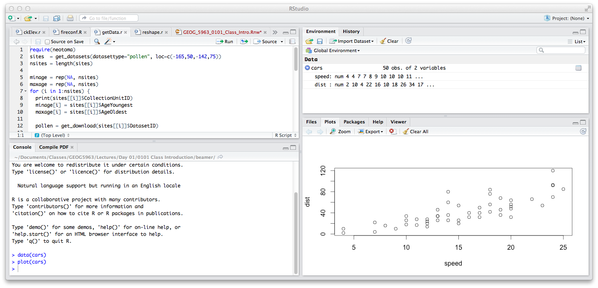

In this lab, we will introduce the basic functionality of R, together with some simple plotting functions. We will be using the following files for these examples:

- A dataset of morphological measurements of three species of penguin *penguins.csv*

More information about this dataset can be found here: [https://allisonhorst.github.io/palmerpenguins/index.html](https://allisonhorst.github.io/palmerpenguins/index.html)


# Introduction to R

## A quick note on formatting

In this and subsequent labs, code that can be entered into R will be high-lit, e.g.:

```{r eval=FALSE}
plot(x, y)
```

And R output will be formatted with `##` at the start of the line. File names will be given in *italics* and will be available in the 'Datafiles' directory on the course Canvas site. 

## Getting started

### RStudio layout

The R Studio interface consists of several windows. Start R Studio from the 'Start' menu under Windows, and the following window should appear:



- *Bottom left*: console window (also called command window). Here you can type simple commands after the `>` prompt and R will then execute your command. This is the most important window, because this is where R actually does stuff.
- *Top left*: editor window (also called script window). Collections of commands (scripts) can be edited and saved. When you don't see this window, you can open it with [File $>$ New $>$ R script]. Just typing a command in the editor window is not enough, it has to get into the command window before R executes the command. If you want to run a line from the script window (or the whole script), copy and paste it to the console. Alternatively, you can click [Run] or press CTRL+ENTER to send it to the command window.
- *Top right*: workspace / history window. In the workspace window you can see which data and values R has in its memory. You can view and edit the values by clicking on them. The history window shows what has been typed before.
- *Bottom right*: Files / plots / packages / help window. Here you can open files, view plots (also previous plots), install and load packages or use the help function. You can change the size of the windows by dragging the grey bars between the windows.

### Working with R

Much of your time spent with R will involve typing commands in at the console, and R Studio has some help with this.

- The up/down arrow keys allow you to cycle back through commands that have been previously entered. You can then modify or reuse these as necessary. The commands can also be accessed through the `History' tab in the top-right panel
- The console has 'tab-completion', which allows you to enter the first few characters of a string or function name, press 'Tab', and R Studio will bring up a list of possible options that match the string you entered. Try typing `pri` and pressing 'Tab' - you should see `print` as part of the list, and you can click on this, or scroll down to use it from the list. 

### Workspace

R has a *workspace* where variables and data are stored as you use it. This is held in the memory of the computer, so if you are working from a file, you will need to read it in to the R workspace, and then work on the values held in memory. This means that you only access files to read in or write out data, the rest of the time you are working on a copy in the workspace. 

### Working directory

R defines the working directory as the folder in which it is currently working. When you ask R to open a certain file, it will look in the working directory for this file, and when you tell R to save a data file or plot, it will save it in the working directory. 

For this class, the labs will assume that you have your files organized according to the following structure:

```
+-- geog6000
|   +-- datafiles
|   +-- lab01
|   +-- lab02
|   +-- lab03
...
|   +-- lab15
```

To do this, go to your `Documents` folder, and create a new folder called `geog6000`. In this now create two new folders, one called `datafiles` (where we will store all the data used across all labs and one called `lab01`, which we will use for today's lab. 

Once you have created these folders, we need to change R's working directory so that it is pointing to `lab01`. The easiest way to do this is by going to the [Session] menu in RStudio, then [Change working directory]. This will open a file browser that you can use to browse through your computer and find the folder. (If you are using the base version of R, go to [File] $>$ [Change dir...] in Windows, or [Misc] $>$ [Change Working Directory] in Mac.)

You can also change the working directory manually using the `setwd()` function in the console. To do this, you may need to know the full path to the folder on your computer. If you followed the instructions given above, this should be:

- On a Windows system: `C:/Users/username/Documents/geog6000/lab01`
- On a Mac OSX system: `/Users/username/Documents/geog6000/lab01`

Where `username` is your name on the computer. You can also find this path by 

- On a Windows system: `
    - Use the File Explorer to select the folder `lab01`
    - Right-click the folder and select 'Properties'
    - In the pop-up window, the path will be listed under 'Location'
    - Highlight this, and copy the path
- On a Mac OSX system: 
    - Use the Finder app to select the folder `lab01`
    - Go to the "View" menu then "Show Path Bar". THis will make the full path appear at the bottom of the Finder window
    - Right-click the Path Bar file name
    - Select "Copy as Pathname"

You can now run the `setwd()` command. Go to the console window in RStudio and enter the following code:

```{r eval=FALSE}
setwd("")
```

And paste your directory. The code should look something like this:

```{r eval=FALSE}
setwd("C:/Users/username/Documents/geog6000/lab01")
```

Note that the slashes are forward slashes and don't forget the quotations.  R is case sensitive, so make sure you write capitals where necessary. To check that you have correctly changed directory, enter the following command, which will show you the current working directory:

```{r eval=FALSE}
getwd()
```

You can also use relative paths. If your current working directory is `geog6000` and you want to change to `lab01`, enter the following code (where the `./` changes the directory to a level higher than the current one).

```{r eval=FALSE}
setwd("./lab01")
```

If your current working directory is `lab01` and you want to change to `geog6000`, enter the following code (where the `../` changes the directory to a level below the current one).

```{r eval=FALSE}
setwd("../")
```

Finally, if your current working directory is `lab01` and you want to change to `lab02`, which is at the same level as the current directory, enter the following code (where the `../` changes the directory to a level below the current one, and `lab02` then moves to the level above that).

```{r eval=FALSE}
setwd("../lab02")
```

Before proceeding with the rest of today's lab, make sure to change your working directory back to `lab01`. 

If this all seems a little foreign to you, don't worry - there will be plenty of opportunities to practice this over the semester. Understanding the directory structure is very important in being able to manage your files both for this class and any analysis you do. 

### Using the console

In the console, the '`>`' is the prompt, and your commands will be entered here. Click on the console window, then enter the following:

```{r}
2+2
```

And press 'Enter', and R will tell you, not too surprisingly, that 2+2=4. The spacing is not relevant, you could equally enter `2 + 2` or `2+ 2` and get the same result. The `[1]` before the output is a vector index. It refers to the first value in the vector (here a vector of length 1). We'll be using this later.

We can equally use standard math functions, for example, to take the natural log or square root of 2:

```{r}
log(2)
sqrt(2)
```

# Working with variables in R

R can use many different file types, but csv files are recommended as the easiest way to transfer between R and Excel.
Start by changing your working directory to the directory holding the two files listed above. Then get a list of files as follows (note the use of the pattern parameter to get only certain files):

```{r}
list.files(pattern=".csv")
```

Larger data sets will most commonly be read in from files. A recommended format to use are csv (comma-separated value) files, as these may be easily exchanged with spreadsheet software. Let's read in the data from the Penguin datafile (*penguins.csv*). Download this file from Canvas, and move it from your `Download` folder to the `datafiles` folder you created earlier. CSV files can be read in using the `read.csv()` function:

```{r}
penguin <- read.csv("../datafiles/penguins.csv")
```

Note that because this file is held in a different folder (`datafiles`) to your current working directory (`lab01`), you need to provide the relative path (`../datafiles`). 

The first part of this code (`penguin <-`) tells R to store the data read in from the file in a *data frame* called `penguin`. To print out the contents of any object in R, simply type the name of that object at the command prompt. Other useful commands are `class()` to see what data class an object is, and `names()` to get a list of the column headers. The function `str()` is probably the most useful, describing the column names and the type of data stored in them.

```{r results='hide'}
penguin
class(penguin)
names(penguin)
str(penguin)
```

The variable `penguin` here represents the whole data frame. If you want to access subsets of the data frame or individual values, you will need to understand indexes in R. There are two main method to access parts of a data frame, the `$` notation, and row/column indexes. The `$` notation allows you to access individual columns:

```{r results='hide'}
penguin$bill_length_mm  	# Extract single column
```

The row/column notation is a more flexible approach, and allows you to access individual rows, columns or values, or to access a range of rows and columns

```{r results='hide'}
penguin[ ,4]   # 4th column
penguin[10, ]  # 10th row
```

Alternatively, you can access a range of rows and columns using `:`:

```{r results='hide'}
penguin[ ,1:4]     # Columns 1 to 4
penguin[1:10, ]    # First 10 rows
penguin[1:50,1:2]  # First 50 rows of the first two columns
```

Note that the data frame can contain different data classes. Compare:
```{r}
class(penguin)			
class(penguin$bill_length_mm)		
class(penguin$species)			
```

To access specific values within a vector, use the index of that value:
```{r results='hide'}
penguin$bill_length_mm[3]      # 3rd element
penguin$bill_length_mm[-3]     # All but 3rd element
penguin$bill_length_mm[1:10]   # First 10 elements
```

Logical operators $<, <=, >, >=, ==, !=$ can be used to select parts of the data set by value. This is very useful if you only want to analyze part of your dataset
```{r results='hide'}
penguin$bill_length_mm[penguin$bill_length_mm > 40]	# All over 40 mm
penguin[penguin$bill_length_mm > 40, ]	# All columns with sepal length over 5 
penguin$bill_length_mm[(penguin$species == 'Adelie')] 	# All "Adelie" penguins
penguin[(penguin$species == 'Adelie'), ] 	# All columns for "Adelie" penguins
```

These operators can be combined, so to get all instances of "setosa" species with sepal lengths greater than 5:

```{r results='hide'}
penguin[(penguin$species == 'Adelie') & (penguin$bill_length_mm > 40), ]
```

## Factors 

The vector of species names (`penguin$species`) is a set of character strings. R has another data type, a **factor** used to represent groups within your data. With a factor, R automatically assumes that every observation with the same name or *level* belongs to a single group, which can greatly facilitate comparing values between groups 

You can convert a vector of character strings to a factor with the `as.factor()` function. The following code replaces the original `species` string with factor:

```{r}
penguin$species <- as.factor(penguin$species)
```

Now let's recheck the class:

```{r}
class(penguin$species)
```

If we now check the first 10 values, you will see some additional information showing the levels of the factor, i.e. the individual groups. 

```{r}
penguin$species[1:10]
```

R automatically sets the levels in alphabetical order, irrespective of the order in the vector. The first level is considered to be the reference level, which has some uses in regression model as we will see later. You can change the order of the levels using the `factor()` function. The following sets the species `virginica` as the reference:

```{r eval=FALSE}
factor(penguin$species, levels = c("Gentoo", "Chinstrap", "Adelie"))
```

We will look further at how factors work in a later lab. 

# Functions in R

Functions typically are comprised of the name of the function (`sqrt` for taking square roots) and a set of parentheses. The parentheses are used to pass data to the function as well as setting parameters to change the behavior of the function.

```{r}
sqrt(5)
```

Note that we can use the assignment operator to save the output from a function, allowing you to use this in subsequent functions and analyses. 
```{r}
y <- sqrt(5)
round(y)
```

To save time and code, functions can be combined:
```{r}
round(sqrt(5))
```

The `seq()` function produces a series of numbers on a regular step. By default, it require 3 parameters, the starting number, the ending number and the step.
```{r}
seq(from = 0, to = 20, by = 2)
```

If you include the parameter names, as in this example, the order does not matter. The parameter names can be omitted if you keep to the specified order of parameters. So `seq(0,20,2)` will give you the equivalent results.

To find out what these parameters are, what they are called and what values they take, use the `help()` function, e.g. `help(seq)`. This will open a window with the help file for that function. If you do not know the name of a function, there is a search function `help.search()`, or use the help browser `help.start()`, browse to packages or use the search engine.

## Univariate statistics

Now create two new vectors in R containing the list of bill lengths and the list of species names. Note the use of the assignment operator `<-`. You can also use the equal sign  (`=`) here and elsewhere in these examples.

```{r}
bl <- penguin$bill_length_mm
sp <- penguin$species
```

R has a large number of inbuilt functions. This section is designed to simply introduce you to the some basic functions for describing data. We'll start by simply calculating the mean of the bill length values

```{r}
mean(bl)
```

This returns the value `NA`, rather than a mean length. So what went wrong? In the original set of data, there are some missing values, also denoted by `NA`. 

```{r}
bl[1:15]
```

R's default for most functions is to not calculate values when there are missing observations. This is really to alert you to the fact that the data are incomplete, and the value you would obtain might be biased. You can overrule this by adding the argument `na.rm=TRUE` to the following functions. This removes `NA`s and calculates the value with whatever is leftover.

Functions to describe the central tendency:
```{r}
mean(bl, na.rm = TRUE)
median(bl, na.rm = TRUE)
```

Functions to describe the dispersion (output not shown):
```{r results='hide'}
sd(bl, na.rm = TRUE)
var(bl, na.rm = TRUE)
min(bl, na.rm = TRUE)
max(bl, na.rm = TRUE)
quantile(bl, na.rm = TRUE)
```

Note that `quantile()` takes a parameter that allows you to choose the quantile to be calculated, e.g. `quantile(bl, c(0.1,0.9), na.rm = TRUE)`, will calculate the 10th and 90th percentile. Try adapting this to calculate the 25th and 75th percentile.

Some other useful functions:
```{r results='hide'}
sum(bl, na.rm = TRUE)
summary(bl)
```

Note that we do not need to tell R to exclude `NA`s for the `summary()` function. This provides a set of summary statistics *and* let's you know how many values are missing. 

Some specific functions for categorical data
```{r results='hide'}
levels(sp)
table(sp)
```

As R is object oriented, functions will adapt to different data types
```{r results='hide'}
summary(bl) ## Summary of numeric vector
summary(sp) ## Summary of categorical vector
summary(penguin) ## Summary of data frame
```

### The `tapply()` function

R has a set of `*apply` functions designed to help to do repetitive tasks. We will look at one of the simplest of these today, the `table` apply function. This *applies* a function (e.g. mean) to a vector, but calculates the function on subgroups defined by categories in a second vector. For example, to calculate the average sepal length per species of penguin, we can do the following:
```{r}
tapply(penguin$bill_length_mm, penguin$species, mean, na.rm = TRUE)
```

Repeat this and calculate the standard deviation per species. 


# Basic plotting in R

We'll now look quickly at the basic plotting functions in R. R has a wide range of plotting types, and we will look at some more complex methods later in this class. For now, we will concentrate on the basic plotting function (`plot()`) and how to simply modify this.

## Index plots

The simplest type of plot is an index plot, which simply plots values in the order they are recorded in the input vector. These are useful for examining the basic data structure and identifying errors and outliers. `plot` is a generic plotting command and will adapt to different data types. The parameter `type='p'` gives the plot type, here using points. Other options are `'l'` for lines, `'h'` for histogram lines, `'s'` for a stepped plot and `'b'` for both line and points. See `help(plot)` for more options and other parameters. 

```{r}
plot(penguin$bill_length_mm, type = 'p')
```

As we have only asked to plot one variable, this is represented on the y-axis. The x-axis gives the index of the observation, in this case from 1 to 350. Other index plots include strip plots and dot plots (also known as Cleveland plots). Here we use a combination of species name and row number to label the plot.

```{r}
stripchart(penguin$bill_length_mm, method = 'stack')

dotchart(penguin$bill_length_mm[1:20], 
         labels = paste(penguin$species[1:20], 1:20, sep = "_"))
```

The final example of an index plot shown in class is the quantile-quantile or q-q plot. This compares the quantiles of the set of data values to equivalent quantiles from a standard normal distribution. The first function used here `qqnorm()` plots this comparison, and if the data set is normally distributed, there should be a linear correspondence between the observed and theoretical quantiles, i.e. they should form a straight line on the scatterplot. The second function, `qqline`, adds a line representing the match between two normal distributions. If the points from the first function fall mainly on this line, we can infer that our data set is close to being normally distributed. 

```{r}
qqnorm(penguin$bill_length_mm)
qqline(penguin$bill_length_mm)
```

## Summary plots 

Summary plots attempt to describe the distribution of the data, giving some ideas about which values are most common and which are most rare. Histograms are commonly used for this method, values are 'binned' into a set of classes, and the histogram represents the frequency of occurrences in that bin. Bins are defined with the `breaks` parameter, which may be set to a constant number in which case the data range is split into that many bins, or as a sequence of numbers defining the intervals between bins. In this latter case, we can make use of the `seq()` function from earlier. 

```{r}
hist(penguin$bill_length_mm, breaks = 20)
hist(penguin$bill_length_mm, breaks = seq(30, 60, 2.5))
```

An alternative to histograms are boxplots, which show information about the data quartiles.
Here the box represents the interquartile data (25-75\% of the data), the thick bar is the median, and the 'whiskers' show the data range.

```{r}
boxplot(penguin$bill_length_mm)
```

This is not hugely informative, but we will expand this plot below:

## Bivariate plots

Bivariate plots are designed to show the relationship between two variables, and how this may vary. The simplest form is the scatter plot. We use the `plot()` function again, but now we give it two variables (x and y). 

```{r}
plot(penguin$bill_length_mm, penguin$bill_depth_mm)
```

As we know that these values come from three difference species, we can use this knowledge
to add extra information to the plot, by using the `col` parameter. We first convert the `Species` vector to a factor class. R will then use the levels of the factor to assign colors to the points. We can also change the symbol type using the `pch` parameter.

```{r}
penguin$species <- as.factor(penguin$species)
plot(penguin$bill_length_mm, penguin$bill_depth_mm,
     col = penguin$species, pch = 16)
```

Let's clean up this plot a little by specifying the axis labels and a title:

```{r eval=FALSE}
plot(penguin$bill_length_mm, penguin$bill_depth_mm,
     col = penguin$species, 
     pch = 16, 
     xlab = "Bill length (mm)", 
     ylab = "Bill depth (mm)",
     main = "Penguin size measurements (Palmer Archipelago)")
```

We can also add a legend to our plot to explain the different colors and symbols. Unfortunately, R makes you do all the work for this, using the `legend()` function. Here, we add a legend to the top left of the plot, giving the labels for each color and the color used:

```{r eval=FALSE}
legend("bottomleft",
       legend = c("Adelie","Chinstrap","Gentoo"),
       col = c(1,2,3), 
       pch = 16)
```

```{r echo=FALSE}
plot(penguin$bill_length_mm, penguin$bill_depth_mm,
     col = penguin$species, 
     pch = 16, 
     xlab = "Bill length (mm)", 
     ylab = "Bill depth (mm)",
     main = "Penguin size measurements (Palmer Archipelago)")

legend("bottomleft",
       legend = c("Adelie","Chinstrap","Gentoo"),
       col = c(1,2,3), 
       pch = 16)
```
Note that we can also use the `levels()` function introduced above to help - this will give us the list of labels to be used in the title:

An alternative way to look at the association between factors and a variable is, again, to use boxplots. Note that this code uses a tilde ($\sim$) between the variable and the set of factors. The tilde is often used to define dependency between two variables, and we will return to this again during the modeling part of this class. 

```{r}
boxplot(penguin$bill_length_mm ~ penguin$species, 
        ylab = 'Bill length (mm)')
```

As the boxplot does not automatically label the y-axis, we add this with the `ylab` parameter. See `help(plot)` and `help(par)` for a complete list of the plotting parameters. 

## Graphic output

By default, R plots graphics to the screen, but has the ability to save figures in most of the standard graphic formats. In order to do this, you first need to open a file (a graphics *device*), then run the plotting functions, then close the device. Remember that you need to plot all the layers of a figure before closing the file. The following example plots the penguin petal data to a pdf file. Alternatives include: png, jpeg, svg, etc.; type `help(Devices)` for more details. 

```{r results='hide', eval=FALSE}

pdf("penguin_bill_length.pdf")

plot(penguin$bill_length_mm, penguin$bill_depth_mm,
     col = penguin$species, 
     pch = 16, 
     xlab = "Bill length (mm)", 
     ylab = "Bill depth (mm)",
     main = "Penguin size measurements (Palmer Archipelago")

legend("bottomleft",
       legend = c("Adelie","Chinstrap","Gentoo"),
       col = c(1,2,3), 
       pch = 16)

dev.off()

```

Alternatively, you can copy-paste directly into Word by going to [Export] -> [Copy to clipboard...] in R Studio's plotting window.


# Quitting R

When you are finished with R, exit by typing `q()` in the console (or going to [File] $>$ [Quit R Studio]). You will be asked if you want to save your workspace. This is generally a good idea, as this will create a file containing all your current data (".RData"), and the history (".Rhistory") of the commands you have used. If you restart R in the same directory, by clicking on an R script file, the workspace will be loaded automatically. If it doesn't, you can load this by changing to the the correct working directory and typing:

```{r eval=FALSE}
load(".RData")
```


# Where to get help

```{r, child = '../get-help.Rmd'}
```

It looks like the following:

```{css, echo=FALSE}

.help-help-page {
  border: 1px solid lightgray;
}

.help-page {
  display: block;
  margin-left: auto;
  margin-right: auto;
  margin-top: 30px;
  margin-bottom: 30px;
  width: 85%;
}
```

<div class="help-help-page">
  <div class="help-page">
```{r echo = FALSE, output="asis"}

fn <- system.file("html/plot.html", package = "base")

bob <- htmltools::includeHTML(fn)

bob <- stringr::str_remove_all(bob, "<a.+\">|</a>")

class(bob) <- c("html", "character")

bob

```

  </div>
</div>
