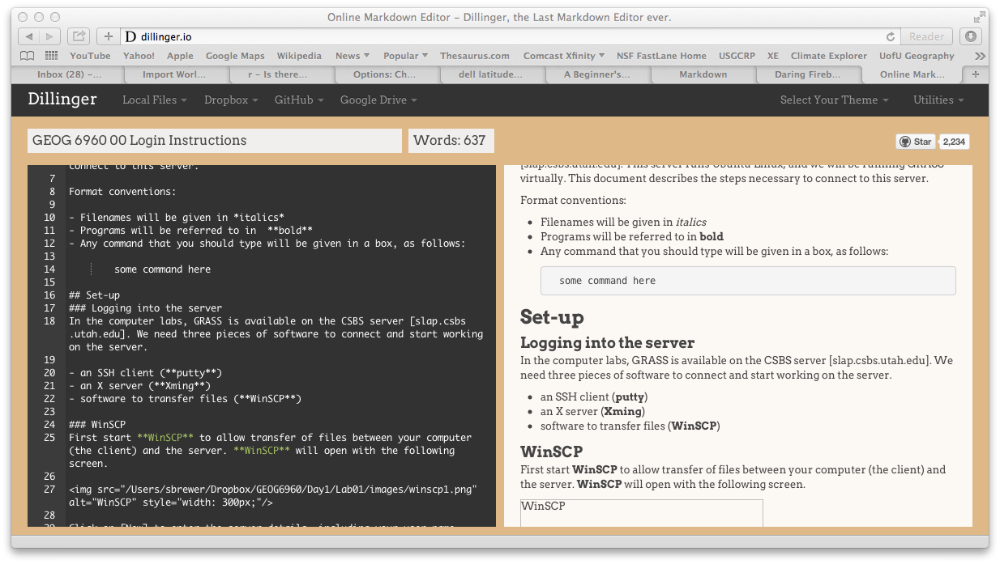
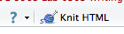
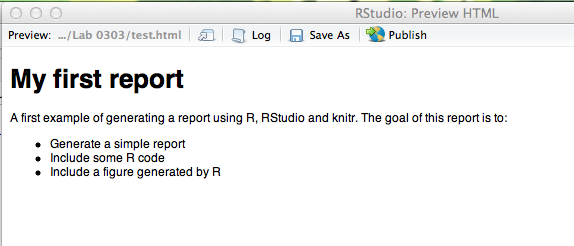

```{r options-chunk, echo=FALSE, message=FALSE} 
require(knitr)
opts_chunk$set(fig.cap="")
``` 

```{r echo = FALSE}
hook_source_def = knit_hooks$get('source')
knit_hooks$set(source = function(x, options){
  if (!is.null(options$verbatim) && options$verbatim){
    opts = gsub(",\\s*verbatim\\s*=\\s*TRUE\\s*", "", options$params.src)
    bef = sprintf('\n\n    ```{r %s}\n', opts, "\n")
    stringr::str_c(bef, paste(knitr:::indent_block(x, "    "), collapse = '\n'), "\n    ```\n")
  } else {
     hook_source_def(x, options)
  }
})
```


# Writing reports from R

R has several add-on packages that allow you to write reports directly from R, incorporating the code, analyses and plots that you would make. These include Sweave, knitr and pander. These can be used to generate a wide variety of output documents, including LaTeX, RTF, the open document format (ODF) and html. One of the most advanced of these is **knitr**, which integrates extremely well with RStudio. Using **knitr**, reports can be generated in html using *markdown*, a simplified version of the full html markup language. 

While this is not obligatory, the exercises and report that you write as part of this course can be generated using **knitr** and markdown. This helps keep your code, answers and figures in a single document for submission. This lab should provide a sufficient introduction for you to be able to write your own documents. 

# Markdown
We'll start with a quick introduction to markdown, before starting to introduce R code into our document. 

You are probably familar with html, the markup language that is used to create web pages. Like most markup languages, it works of a series of tags that are used to format different parts of the text. For example, `<h1>` and `</h1>` indicate that the enclosed text is a "level one header", or `<em>` and `</em>` indicate emphasis (generally italics). A web browser will parse the html tags and render the web page, often using a Cascading style sheet (CSS) to define the precise style of the different elements.

Writing directly in html is difficult, as it is necessary to remember all these tags and how they all fit together (an example html document is shown in appendix 1)

Markdown is designed to simplify this, by using very simple formatting. For example, text starting with `#` is a header, text enclosed by `*` is emphasized, and so on. The result is a file that is easy to read even before it is processed into html, and has an easy method for including code: the backtick (on the key to the left of the '1' on your keyboard. See appendix 2 for an example. 

## Markdown syntax
Here is a brief introduction to markdown syntax. Much more detail can be found [here][mdID]

### Headers
Headers are indicated in markdown using hashmarks `#`. One is a top-level header, two a sub-header and so on up to six sub-headers. The main header can also be defined by adding a line of equal signs on the next line. The two following bits of code will do the same thing:

    # My header

    My header
    =========

### Emphasis and bold

Bold text can be written as

    **This is bold text**

Emphasized text uses a single asterix:

    *This text will be emphasized*
  
### Lists

markdown can generated unnumbered lists as a set of bullet points:

    - List item 1
    - List item 2
    - List item 3
    
  Or as numbered lists:

    1. List item 1
    2. List item 2
    3. List item 3
    
### Hyperlinks

Links to web pages can be included in a couple of different ways. The word that will have the hyperlink is enclosed in `[  ]`, and followed by a reference. Elsewhere in the document (usually at the end) the reference is connected to the full URL. For example:

    I get 10 times more traffic from [Google][1] than from [Yahoo][2] or [MSN][3].

    [1]: http://google.com/        "Google"
    [2]: http://search.yahoo.com/  "Yahoo Search"
    [3]: http://search.msn.com/    "MSN Search"

will convert the words "Google", "Yahoo" and "MSN" in the first line into hyperlinks. 

### Horizontal lines
A horizontal line can be specified by a line of hypens:

    -----

### Code
The ease in which prgramming code can be formatted in a document has made markdown a favorite tool for writing documents and tutorials on programming. For example, all of the lab documents for this course are written using markdown. Text that should be formatted as code is usually show enclosed in backticks or by identing the code by four spaces (one tab stop).

\begin{verbatim}
```
Some code
```
\end{verbatim}
Or

      Some code

## Processing markdown

Once the markdown file is written, it can be processed into html. There are quite a few processors that can be used, but a couple of good online free processors and editors are [stackedit] [seID] and [dillinger][dlID].



Dillinger interface showing the markdown editor on the left and the processed html on the right. 

# RStudio, R Markdown and **knitr**

## R Markdown

[R Markdown][rmID] is a variant of Markdown developed by the same people who developed RStudio. It allows you to embed *chunks* of R code which is then used with the **knitr** package to create reproducible web-based reports. The clever part about **knitr** is that it will take this code, and actually run it in R. So any R code you include will be processed, and the results can be displayed. This has several advantages: 1) it makes sure that the results are exactly those produced by R (and that the code is consistent with the results); 2) it allows you to easily update your report using new or extra data; 3) the figures are produced directly in the report; 4) your reports are easy to publish on the web. 

## knitr

[knitr][knID] is a package developed by Yihui Xie to embed R code into different documents. This needs to be installed on your computer before you can start generating reports. Use the instructions from the previous lab to install this package.[THIS NEEDS UPDATING]

# A first R Markdown document

In RStudio, go to the 'File' menu > 'New File' > 'R Markdown'. A new markdown document will open in the top-left panel. This is a template and already has some markdown code in it, including a header that will look something like:

```
---
title: "Untitled"
author: "Simon Brewer"
date: "8/19/2020"
output: html_document
---
```

Start by updating the header - give this a useful title and make sure your name is there. Then highlight and delete the remaining text to leave a blank document. 

We'll start by adding a short introduction. Type the following code into the document:

    # My first report
    A first example of generating a report using R, RStudio and **knitr**. 
    The goal of this report is to:
    
    - Generate a simple report
    - Include some R code
    - Include a figure generated by R

Save the file into your current working directory (it will save with the extension *.Rmd). Now we need to process this with **knitr**. On the top menu of the editor panel, you should see a button 'Knit HTML'.



Click this button, and **knitr** will process the file. Once done, RStudio will open a preview window showing your markdown code converted to html:



If you look in your working directory, you should see a new html file with the same name as the R Markdown file. This can be open directly in a browser. 

We'll now add some R code into this document. Each block of code is called a 'chunk' and is preceded by three backticks and the string `{r}`. The chunk is ended by another three backticks. So a very simple example to add two numbers would be:

    ```{r}`r ''`
    5 + 6
    ```

Add this to your markdown file, and click on the 'Knit HTML' button. Check the html preview window, and you should see the following lines added to your output:

```{r}
5 + 6
```

The html output therefore has, not only the R code that you entered, but the result of that code. 

We'll now add more code to this example to read in some data and calculate summary statistics. Add the following code to read in the GISS global temperature data set *giss_temp.csv*, and calculate some summary statistics. 

    ```{r}`r ''`
    giss = read.csv("giss_temp.csv")
    summary(giss)
    ```
Add some text before and after the code to explain what is going on. Remember that you can  add sub-headers with two hashmarks `##`. Other formatting tips can be found by clicking on the button with a question mark, and selecting 'Markdown Quick Reference'. 

Now add code to calculate the mean temperature deviation per year, and make a vector of years:
    
    ```{r}`r ''`
    annualTemp = tapply(giss$TempAnom, giss$Year, mean)
    years = unique(giss$Year)
    ```
Again, add some text with outside of the backticks to explain what is going on. Click 'Knit HTML' to check the output. 

Finally, we'll add a couple of plots to the output. Before doing this, we'll add a subheader to the file and a short amount of text

    ## Plot section
    First, a histogram showing the distribution of all temperature anomaly values. 
    Second, a plot of annual temperature change.

Now start by plotting a histogram of all the temperature values:
    
    ```{r}`r ''`
    hist(giss$TempAnom, breaks=20)
    ```
And a line plot showing the annual temperatures
    
    ```{r}`r ''`
    plot(years, annualTemp, type='l', lwd=2, col=2, 
          xlab="Years", ylab="Temp Anom")
    abline(h=0, lty=2)
    ```

Add some text to explain what the code is doing, and click 'Knit HTML' to get the final report. When it is finished, go to your working directory, and double click the *.html file to open this in a browser. 

## Chunk options

**knitr** has a set of [options][opID] for modifying the way in which the chunks are run. This is done by adding options in between brackets at the start of the chunk (`{r}`). For example, `{r echo=FALSE}` will run the code, but not display it in the document. Some other options are:

- `fig.keep=FALSE`: doesn't display any figures
- `fig.width=10`: alters the figure width (size in inches)
- `fig.height=7`: alters the figure height (size in inches)
- `results='hide'`: doesn't display any output from R
- `eval=FALSE`: don't run the R code
- `cache=TRUE`: only run the R code once and save the output for subsequent 'knits'. This is very useful for code that takes a long time to run

Multiple options can be used by separating them by commas, e.g. `{r fig.width=10, fig.height=7}` will make a 10x7 figure in the output. 

If you need to set chunk options for the entire diagram, this can be done using the `opts_chunk$set()` function. When you opened the file, you should have seen a line that looked like this:

    ```{r}`r ''`
    knitr::opts_chunk$set(echo = TRUE)
    ```

Any options added to this (between the parentheses) will then be applied to all chunks. 

# Where to get help

```{r, child = '../get-help.Rmd'}
```


[kbID]: http://kbroman.github.io
[mdID]: https://daringfireball.net/projects/markdown/syntax
[seID]: https://stackedit.io
[dlID]: http://dillinger.io
[rmID]: http://rmarkdown.rstudio.com
[knID]: http://yihui.name/knitr/
[opID]: http://yihui.name/knitr/options/
[cranID]: http://cran.us.r-project.org
[tvID]: https://cran.r-project.org/web/views/